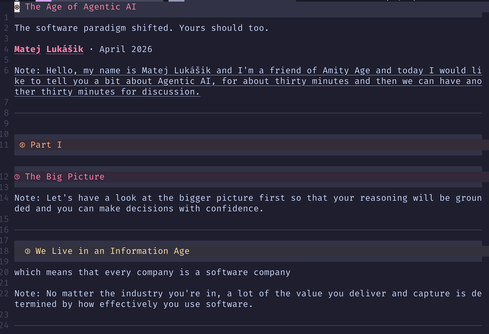

# The Age of Agentic AI

The software paradigm shifted. Yours should too.

**Matej Lukášik** · April 2026

Note: Hello, my name is Matej Lukášik and I'm a friend of Amity Age and today I would like to tell you a bit about Agentic AI, for about thirty minutes and then we can have another thirty minutes for discussion.

---
<!-- .slide: class="center more-paragraph-space" -->

## Part I
# The Big Picture

Note: Let's have a look at the bigger picture first so that your reasoning will be grounded and you can make decisions with confidence.

---

### We Live in an Information Age

which means that every company is a software company

Note: No matter the industry you're in, a lot of the value you deliver and capture is determined by how effectively you use software.

---
### The Evolution of Software Distribution

| Era | Medium | Model |
|-----|--------|-------|
| 1980s - 2000s | 💾,💿 Floppy disks, CDs, DVDs  | Physical distribution |
| 2000s - 2025 | 🌐 Web & SaaS | Cloud subscriptions |
| 2025+ | 🤖 Agents | On-demand generation |


Note: At the beginning of the era of personal computers, developing and distributing software was difficult and expensive.

First, we had to write it in clumsy languages and then physically distribute it on floppy disks, CDs or later DVDs.

Then came the SaaS revolution, when we could distribute the software via the browser. Some of you might be young enough to not be able to remember this, but the fact that companies did not have to contractually commit to a set version of software but instead could sign up online, pay comparatively very low monthly and could start using the software immediately was revolutionary.

Today, we are entering a new software paradigm, a paradigm of Agentic AI. In this era, only the most powerful and complicated applications are built by big companies and subscribed to using the SaaS model. The rest is built by on-demand. On a long enough time horizon, maybe even the browser will dissapear and all you do is talk to your agent.

Why is that?

---


### The Cost of Software is Collapsing

Instead of:

`
Research tools → Compare pricing →
Sign contract → Learn UI
`
<!-- .element: style="font-size: 0.5em" -->
You can:

```bash
$ claude "build me a tool that does X"
# → Working software in minutes
```


Note: You used to:
- identify a problem in the company
- research tools that would help you solve it
- judge whether they are compatible with what you are already using 
- decide on the tier and the number of seats
- onboard everyone in the company to use them.

__AND STILL HOWEVER MUCH you tried, the software never did everything you needed, and you always thought "if only it could do X"__

With the advent of capable coding agents like claude code or codex you can sit down and write the exact software you need in minutes.

---
<!-- .slide: class="center" -->
## KEY TAKEWAY

<!-- .slide: class="center more-paragraph-space" -->
change your thinking from:


#### "What tool should I subscribe to next to solve my problem?"

to:

#### "How do I specify this well enough so that my coding agent can build it in one shot?"


Note: Here is the key takeway: Change your thinking FROM, TO. Use few solid tools, like Google Docs, Trello, Slack and drive the information flows in between them using agents. Since agents can now use any tool via either CLI tools, MCP server or the browser itseld, it makes more sense to build your own integrations that exactly suit your needs rather than wait for companies to build them.

If there is a little online tool you would like to use, but you need to sign up for it (because there is an upsell or a premium feature funnel down the road), don't do it. Ask your agent to write the tool for you. It will cost you a few cents, but it will be exactly as you need it and it will be free forever.

This is a subtle shift, Andrej Karpathy describes it as software becoming ephemeral, and it might take some time to click.

---
<!-- .slide: class="center" -->

## Part II

# What is an AGENT?
Note: One of the reasons we are talking today is that there is so much hype and almost a sense of FOMO around Agentic AI.

There is also the counternarrative of AI being a useless producing slop machine and stories of agentic workflows gone terribly wrong.

---


<!-- .element: style="max-height: 76vh; width: auto; border-radius: 12px; box-shadow: 0 18px 40px rgba(0, 0, 0, 0.28)" -->
Note: The truth is somewhere in the middle. Let me walk you through what an agent is and pull the curtain for you, so that your understanding can touch solid ground and move forward with confidence.

---

### Brain + Tools + Memory + Agency =
## Agent 
Note: ChatGPT by itself is just an LLM chatbot, however, give it a brain, tools, memory and agency and it becomes a very capable Agent that can do a lot of knowledge work for you.

---

BRAIN -> writes plans, reviews them, reasons about the next best step

---
<!-- .slide: class="compact-code" style="padding: 0; top: 0 !important; height: 700px" -->
```python
# Step 1: ask for a plan
planning_response = client.messages.create(
    model="claude-opus-4-6",
    system="You are an operations agent. When given a task, first output a numbered plan. Be specific.",
    messages=[{"role": "user", "content": "Assess whether our mining is profitable right now."}]
)

# model returns:
# "1. Fetch current BTC price
#  2. Fetch current network difficulty
#  3. Fetch our hashrate and power cost
#  4. Calculate revenue vs cost
#  5. Return a verdict"

plan_steps = parse_plan(planning_response)  # split on numbered lines

# Step 2: execute each step, feeding results back as context
for step in plan_steps:
    response = client.messages.create(
        model="claude-opus-4-6",
        system="Execute this single step. Use tools if needed. Be concise.",
        messages=conversation + [{"role": "user", "content": f"Current step: {step}"}]
    )
    conversation.append({"role": "assistant", "content": response.content[0].text})
```
<!-- .element: style="font-size: 0.44em; line-height: 1.04; white-space: pre-wrap; max-height: none; margin: 0; width: 100%; height: 700px; padding: 1em 1.05em" -->

Note: The intention here is not to go into the details and explain the code, but rather show you, that what we call an intelligent agent is a clever combination of good old structured workflows and LLMs.

---

TOOLS -> lets it browse the web, call APIs, write files, send messages, execute code, etc.

---
<!-- .slide: class="compact-code" style="padding: 0; top: 0 !important; height: 700px" -->
```python
# What YOU write (clean API call):
response = client.messages.create(
    model="claude-opus-4-6",
    tools=tools,
    messages=[{"role": "user", "content": "Is mining profitable right now?"}]
)

# What the model ACTUALLY sees (roughly — Anthropic injects this into the context):
"""
You have access to the following tools:

<tools>
  <tool>
    <name>get_btc_price</name>
    <description>Fetch the current Bitcoin price in USD</description>
    <input_schema>{"type": "object", "properties": {}}</input_schema>
  </tool>
  <tool>
    <name>get_hashrate</name>
    <description>Fetch current hashrate from the mining dashboard</description>
    <input_schema>{"type": "object", "properties": {"rig_id": {"type": "string"}}}</input_schema>
  </tool>
</tools>

If a tool is appropriate, respond with a tool_use block.
If no tool is needed, respond directly.

User: Is mining profitable right now?
"""

# Model responds with:
# {"type": "tool_use", "name": "get_btc_price", "input": {}}
# — your code executes it, result goes back into context, loop continues
```

<!-- .element: style="font-size: 0.44em; line-height: 1.04; white-space: pre-wrap; max-height: none; margin: 0; width: 100%; height: 700px; padding: 1em 1.05em" -->
---

MEMORY -> keeps context across time

---
<!-- .slide: class="compact-code" style="padding: 0; top: 0 !important; height: 700px" -->
```python
import anthropic
import numpy as np

client = anthropic.Anthropic()

# --- WRITE: storing a memory ---
fact = "Rig #12 was replaced on 2025-11-03 due to a failed PSU."

embed_response = client.messages.create(  # in practice: use a dedicated embeddings API
    model="claude-opus-4-6",              # e.g. OpenAI embeddings or a local model
    ...
)
vector = get_embedding(fact)   # → [0.021, -0.843, 0.374, ...]  (1536 floats)
vector_db.store(vector, metadata={"text": fact, "date": "2025-11-03", "rig": 12})

# --- READ: at the start of every agent run ---
query = "Is rig #12 behaving normally?"
query_vector = get_embedding(query)

# fetch the top 3 most semantically similar memories
results = vector_db.search(query_vector, top_k=3)
# → ["Rig #12 was replaced on 2025-11-03 due to a failed PSU.",
#    "Rig #12 average hashrate: 98 TH/s",
#    "Rig #12 flagged for elevated temp on 2025-10-28"]

# inject only the relevant memories into the system prompt
system_prompt = f"""You are an operations agent.

Relevant context from memory:
{chr(10).join(results)}

Use this context when answering. Do not hallucinate hardware history."""
```
<!-- .element: style="font-size: 0.44em; line-height: 1.04; white-space: pre-wrap; max-height: none; margin: 0; width: 100%; height: 700px; padding: 1em 1.05em" -->
Note: Normally an LLM only remembers what is in it's current context and we have to reset it when we reach the context window. We can create note files and then later load them into the context. However, the real nice way to do this, is to periodically save summarizations of our conversations in a vector database and then search this database while working prompts thus seemingly remembering all we ever talked about.

---

AGENCY -> means it can decide and act in a loop

---
<!-- .slide: class="compact-code" style="padding: 0; top: 0 !important; height: 700px" -->
```python
messages = [{"role": "user", "content": user_input}]

while True:
    response = client.messages.create(
        model="claude-opus-4-6",
        system=system_prompt,
        tools=tools,
        messages=messages
    )

    if response.stop_reason == "end_turn":
        print(response.content[0].text)
        break                                    # agent is done

    if response.stop_reason == "tool_use":
        tool_call = response.content[0]
        result = execute_tool(tool_call.name, tool_call.input)  # your code runs here

        messages.append({"role": "assistant", "content": response.content})
        messages.append({"role": "user", "content": [{
            "type": "tool_result",
            "tool_use_id": tool_call.id,
            "content": str(result)
        }]})
        # ↑ loop continues — model sees the result and decides next step
```

<!-- .element: style="font-size: 0.44em; line-height: 1.04; white-space: pre-wrap; max-height: none; margin: 0; width: 100%; height: 700px; padding: 1em 1.05em" -->
---
<!-- .slide: class="center" -->
## KEY TAKEWAY
LLMs are not agents

Agents use LLMs to achieve your goals

Note: Here is a metaphor to help you think about this: You own your computer, you can take it anywhere, you can upgrade it's HW, install anything on it. However, you always need electricity to power it. In the same way, you should think about your agents, they should be yours, on your file systems and ideally run on your HW. To power them, instead of electricity, you supply them with intelligence. Intelligence is provided by different companies (openai, anthropic), that are competing for your dollars. You can choose different LLMs for different agents and different tasks based on their capabilities and pricing.

From a perspective of a Bitcoin company like Amity Age, this paradigm also allows you to spend satoshis for intelligence and get a fair discount for doing so by using solutions like routstr.

However, this is the exact same dilemma as with Bitcoin custody, the more sovereign you want the setup to be, the more work and inconvenience for you. On the other hand there are whole AI suites like the Claude Cowork that provide high levels of convenience but lock you into a vendor and can become more expensive.

Make no mistake about it, agents can get expensive and as you discover their power, you will want to use them more and more. Even though they will be 10x cheaper than if you would ask human to do the same work, the costs will add up.

This is one of the choices you will have to make going forward. What levels of sovereignity and self-sustainability do we want and what are we willing to pay for it?

---

## Part III
# The Use Cases

Note: OK, now that we understand there is nothing magical about agents and AGI is not here yet, let's look at the most common ways agents are used in companies. As we move through them, I will also point out different patterns and paradigm shifts that I can see emerging.

---
## Inbox Triage + Drafting

Note:
- Give your agent access to your inbox, it can classify emails, extract fields, forward if necessary and draft responses so that you can later just check them and send them
- If there is anything unusual or he is not sure, he can escalate to you via another channel
- Slowly over time you can teach the agent to treat your inbox just like you would

**Failure modes**: Wrong classification, wrong tone, too much access, accidental external reply.

---

## Calendar Scheduling + Coordination

Note: 
- You give agent access to your calendar and then ask it to schedule meetings using your voice via Telegram or any other channel. This is how we all imagined Siri would work.
- It checks for conflicts, sends invites, follows up if unanswered etc.

**Failure modes**: Auth friction, time-zone errors, missing buffers, double-booking.

---

## Research

Note:
- Research agent gathers sources, summarizes findings, and turns them into briefs for you to read any time.
- When preparing the list of use cases we are going through right now, I asked my agent to search for the 30 most popular YT videos on agent use cases, transcribe them all and then extract the most common use cases.

**Failure modes**: Hallucinations, weak sources, missing citations, drifting away from the rubric.

---

## Monitoring + Alerts


Note:
- For things that have clear definitions and metrics, like for example bitcoin price, it is easy to set an alert.
- But for things that are harder to define and judgment is needed, like monitoring news, monitoring competition etc. monitoring and alerting is more difficult.

**Failure modes**: Brittle scraping, noisy alerts, and Terms-of-Service constraints.

---


Note: Here is an example. Things in AI are moving so fast, you have to check the news every day. But I don't want to spend my time going through the list of news and spend my cognitive cycles on whether this particular news piece is relevant to AI or not. I asked my agent to go to this website every day, and extract only the news that are relevant to AI and send them to me via Telegram.

---

## Pull, Don't Poll

Agents can
- watch inboxes, dashboards, feeds, and databases
- pull out what changed
- summarize what matters
- route it to the right person
- take the next step when allowed

**The interface matters less. The outcome matters more.** <!-- .element: class="fragment" -->

Note: This way of monitoring data feeds is another subtle paradigm shift. The browser makes humans poll systems for updates.Software used to be something you had to go check. With agents, the software starts working in the background and brings you the update so that you don't have to waste your time on the comparison

---

## Knowledge Base

Note:
- You connect your company documents, standard operating procedures, contracts and internal knowledge and let the agent answer repetitive customer questions
- It can either answer directly or draft a response for a human to approve, depending on the risk level

**Failure modes**: Prompt injection, stale docs, brand-tone mistakes, compliance and logging gaps.


---

## Lead Generation + Enrichment

Note:
- The agent finds leads, enriches company data, drafts personalized outreach and keeps the pipeline organized for you
- This is easy to measure and A/B test
- You can think of it as outsourcing the top of your sales funnel to software

**Failure modes**: Legal and ToS risk, low-quality data, spammy outreach, poor deliverability.

---

## Document Processing

Note:
- You feed the agent receipts, invoices, contracts or scanned PDFs and it extracts the relevant fields into structured data

**Failure modes**: OCR edge cases, vendor template variance, and sensitive financial data handling.

---

## Content Operations

Note:
- You feed the agent your podcasts, videos, blog posts etc. and let the agent turn it into posts, clips, emails and give it all publishing schedule
- This is great for short form content marketing, education, etc.

**Failure modes**: Generic voice, factual drift, uneven quality, over-automation.

---

## Browser Automation

Note:
- Sometimes there is no API, and the only way to automate a workflow is to let the agent operate the browser directly
- It clicks through portals, fills forms, downloads files and completes repetitive web tasks that humans would otherwise do manually
- This unlocks the last mile of automation for many legacy systems

**Failure modes**: Brittle selectors, MFA friction, session expiry, costly mis-clicks.

---

## Voice Agents

Note:
- These are phone-based agents for intake, booking, qualification and simple outbound workflows

**Failure modes**: Trust, quality variance, consent/compliance issues, very visible failures.

---
<!-- .slide: class="center" -->
## Part IV

# Tips

---

## Start turning everything into data

To fully leverage agents, turn as much as you can into text. 

This way your agents can see it, reason about it, find connections and insight you might miss.

Note: In your case, I would start leveraging Google Docs. Imagine this: Everyday, most of the work you have done, is saved and made available in a Google Drive folder your agent can access. Every night, each of your agents scan through the work you have done and look for connections. If they see connections in between your work, they will let you know or even automatically report.

<!-- --- -->

<!-- ## Presentation as an md file -->
<!--  -->

<!-- Note: For example I decided to adopt the markdown file format everywhere I can. This presentation is a text file, that I can then cut up, expand, summarize any way I like. --> 

---

## Autoresearch

Andrej Karpathy's experiment: **let AI conduct ML research overnight**

- Agent modifies `train.py`, runs 5-min experiments
- Evaluates results, keeps improvements, discards failures
- ~12 experiments/hour → 100+ iterations overnight
- Wake up to improved models + detailed logs

**This is the future: AI agents that improve themselves.**

[github.com/karpathy/autoresearch](https://github.com/karpathy/autoresearch)

---
<!-- .slide: class="center" -->

## Part V

# Actions You Can Take Now

---

## Start Tomorrow

**1. Spin up a VPS with Docker** <!-- .element: class="fragment" data-fragment-index="1" -->

One container per employee with OpenClaw <!-- .element: class="fragment" data-fragment-index="1" -->

**2. Give each employee a token budget** <!-- .element: class="fragment" data-fragment-index="2" -->

$100 worth of tokens is enough to explore and build intuition <!-- .element: class="fragment" data-fragment-index="2" -->

**3. Start small, find the friction** <!-- .element: class="fragment" data-fragment-index="3" -->

Ask each employee to find friction in their workflows. Look for repetitive tasks: reports, data extraction, formatting, scheduling, etc. <!-- .element: class="fragment" data-fragment-index="3" -->

---
<!-- .slide: class="center" -->

## Part VI

# How I Can Help
Note: Overall, I tried to give you a good foundation, so that you can be confident in taking the next steps by yourselves. However, if you feel like you need more help, here are some of the services I offer you. 

---

## Services

**🎯 Consulting & Advisory** <!-- .element: class="fragment" data-fragment-index="1" -->

Assess workflows, identify high-impact automation opportunities, build adoption roadmap. <!-- .element: class="fragment" data-fragment-index="1" -->

**🔧 Implementation** <!-- .element: class="fragment" data-fragment-index="2" -->

Design and deploy custom AI agents tailored to your processes. From single-task automations to multi-agent orchestration. <!-- .element: class="fragment" data-fragment-index="2" -->

**📚 Training & Workshops** <!-- .element: class="fragment" data-fragment-index="3" -->

Hands-on sessions for your team. From prompt engineering to production agent workflows. Build internal capability, not dependency. <!-- .element: class="fragment" data-fragment-index="3" -->

---
<!-- .slide: class="center" -->

## The Bottom Line

The age of agentic AI is here. But just like with everything else, there is a learning curve.

Don't FOMO, learn to walk before you can run.

Stay safe!

---
<!-- .slide: class="center" -->

# Thank You

**Matej Lukášik**

Questions?

